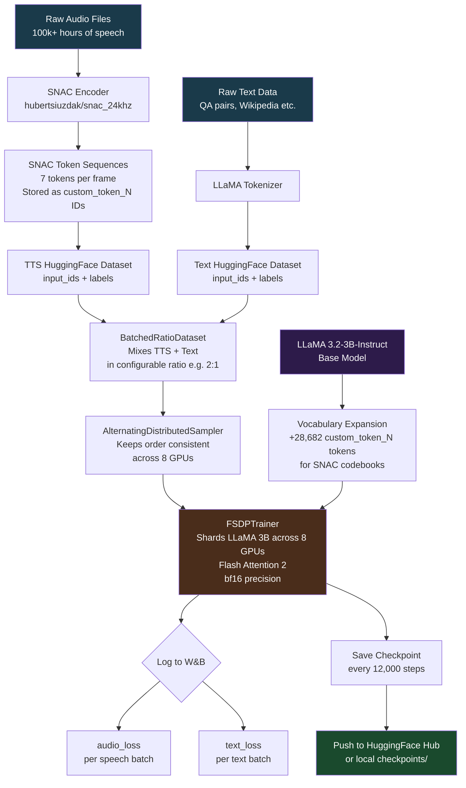
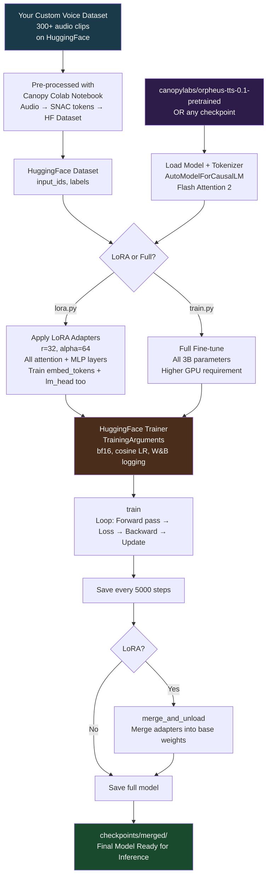
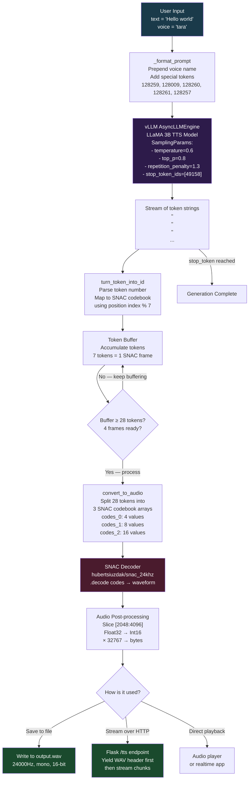

# 🦜 Orpheus TTS — Complete Repository Report

> A plain-English, deep-dive reference for every file, concept, data flow, and metric in this repository.

---

## Table of Contents

1. [What is Orpheus TTS?](#1-what-is-orpheus-tts)
2. [Big Picture Architecture](#2-big-picture-architecture)
3. [Repository Structure — Every File Explained](#3-repository-structure--every-file-explained)
4. [Training Phase — Pretraining Deep Dive](#4-training-phase--pretraining-deep-dive)
5. [Training Phase — Finetuning Deep Dive](#5-training-phase--finetuning-deep-dive)
6. [Training Flowcharts](#6-training-flowcharts)
7. [Inference / Testing Phase Deep Dive](#7-inference--testing-phase-deep-dive)
8. [Inference Flowchart](#8-inference-flowchart)
9. [Data Flow: From Text to Audio (Step by Step)](#9-data-flow-from-text-to-audio-step-by-step)
10. [Emotion & Voice Control System](#10-emotion--voice-control-system)
11. [Metrics & Evaluation](#11-metrics--evaluation)
12. [Deployment Options](#12-deployment-options)
13. [Key Dependencies Explained](#13-key-dependencies-explained)
14. [Quick-Reference Cheat Sheet](#14-quick-reference-cheat-sheet)

---

## 1. What is Orpheus TTS?

**Orpheus TTS** is a state-of-the-art, open-source **Text-to-Speech (TTS)** system made by **Canopy Labs**. It converts written text into very natural-sounding human speech — including emotions, laughter, sighs, coughs, and other non-verbal sounds.

### What makes it special?

| Feature | What it means in plain English |
|---|---|
| **Built on LLaMA 3B** | It reuses a powerful language model (the same family as ChatGPT-style models) instead of building a speech model from scratch |
| **SNAC audio codec** | Audio is compressed into "codes" (like a ZIP file for sound) and the LLM generates those codes, not raw audio |
| **~200ms streaming latency** | You start hearing audio very quickly after asking — almost like a phone call |
| **Zero-shot voice cloning** | You can clone a voice by just providing text+audio examples — no retraining needed |
| **Emotion tags** | You can control how speech sounds by inserting tags like `<laugh>`, `<sigh>`, `<yawn>` |
| **100k+ hours of training data** | Massive scale of real human speech makes it sound very natural |

---

## 2. Big Picture Architecture

The model works in **two stages**:

```
TEXT IN  ──►  [ LLaMA 3B LLM ]  ──►  AUDIO TOKEN CODES  ──►  [ SNAC Decoder ]  ──►  AUDIO OUT (.wav)
```

### Stage 1: Language Model (LLaMA 3B)
- Takes text as input
- Generates a special sequence of **audio tokens** (numbers that represent sound)
- These are **not** normal word tokens — they are special `<custom_token_N>` tokens added to the vocabulary

### Stage 2: SNAC Audio Codec Decoder
- Takes those audio tokens and converts them back into real audio waveforms
- SNAC is a neural audio codec — it works like a "reverse compression" step
- Sample rate: **24,000 Hz** (good quality speech)

### Why use an LLM for TTS?
Traditional TTS systems use dedicated speech models. Orpheus uses an LLM because:
- LLMs already understand language, meaning, and context deeply
- This gives **emergent abilities** like natural intonation, emotion, and rhythm — the LLM "knows" when a sentence should sound happy, sad, or surprised without explicit rules

---

## 3. Repository Structure — Every File Explained

```
Orpheus-TTS/
├── README.md                          ← Main documentation
├── LICENSE                            ← Apache 2.0 open-source license
├── .gitignore                         ← Tells git what to ignore
├── emotions.txt                       ← List of emotion keywords
├── demo.mp4                           ← Demo video of the system
│
├── pretrain/                          ← Scripts to train the BASE model from scratch
│   ├── config.yaml                    ← Hyperparameters for pretraining
│   ├── train.py                       ← Main pretraining script
│   └── readme.md                      ← Explanation of pretraining strategy
│
├── finetune/                          ← Scripts to fine-tune an existing model
│   ├── config.yaml                    ← Hyperparameters for finetuning
│   ├── train.py                       ← Main finetuning script (full fine-tune)
│   └── lora.py                        ← LoRA fine-tune (low memory alternative)
│
├── orpheus_tts_pypi/                  ← The installable Python package (pip install orpheus-speech)
│   ├── setup.py                       ← Package metadata and install requirements
│   ├── pyproject.toml                 ← Modern Python packaging config
│   ├── README.md                      ← Short pip package description
│   ├── orpheus_speech.egg-info/       ← Auto-generated install metadata (ignore this)
│   └── orpheus_tts/
│       ├── __init__.py                ← Package entry point — exposes OrpheusModel
│       ├── engine_class.py            ← Main inference engine (the brain of inference)
│       └── decoder.py                 ← Audio decoder (converts tokens → audio bytes)
│
├── realtime_streaming_example/        ← A live web streaming demo
│   ├── main.py                        ← Flask web server that streams audio in real time
│   └── client.html                    ← Simple browser page to test the streaming
│
└── additional_inference_options/      ← Extra ways to run the model
    ├── baseten_inference_example/
    │   ├── README.md                  ← How to deploy on Baseten cloud
    │   └── call_orpheus.py            ← Script to send many parallel requests to Baseten
    ├── no_gpu/
    │   └── README.md                  ← How to run without a GPU using llama.cpp
    └── watermark_audio/
        ├── watermark.py               ← Core watermarking functions (embed + verify)
        ├── watermark_sample.py        ← End-to-end example: generate + watermark + verify
        ├── watermarking_sample.md     ← Documentation for watermarking
        └── DockerIsolation            ← Docker setup notes for watermarking
```

### File-by-File Deep Dive

#### `README.md`
The main landing page. Tells you:
- What the model can do (emotions, voice cloning, low latency)
- Which HuggingFace models exist (pretrained vs finetuned)
- How to install and run inference
- How to finetune or pretrain
- Links to Colab notebooks

#### `emotions.txt`
A plain text list of **20 emotion/style keywords**:
```
happy, normal, disgust, sad, frustrated, slow, excited,
whisper, panicky, curious, surprise, fast, crying, deep,
sleepy, angry, high, shout, longer
```
These are used as reference for what emotional styles the model supports. They map to tags you insert in the text prompt (e.g., `<laugh>`, `<sigh>`).

#### `LICENSE`
Apache 2.0 — the model and code are free to use commercially, with attribution.

---

### `pretrain/config.yaml`
**Purpose:** Controls all the settings for training the model from scratch.

| Setting | Value | What it means |
|---|---|---|
| `model_name` | `meta-llama/Llama-3.2-3B-Instruct` | Start from Meta's 3-billion-parameter LLaMA model |
| `tokenizer_name` | same | Use LLaMA's tokenizer as the base |
| `epochs` | `1` | Go through the dataset once |
| `batch_size` | `1` | 1 sample per GPU per step |
| `number_processes` | `8` | 8 GPUs in parallel |
| `pad_token` | `128263` | Token ID used to pad sequences to equal length |
| `save_steps` | `12000` | Save a checkpoint every 12,000 steps |
| `learning_rate` | `5e-5` | How fast the model learns |
| `ratio` | user-defined | Ratio of text batches to TTS batches (e.g., 2:1) |
| `text_QA_dataset` | user path | Dataset of plain text (QA pairs, Wikipedia, etc.) |
| `TTS_dataset` | user path | Dataset of speech audio tokens |

---

### `pretrain/train.py`
**Purpose:** The full pretraining script. The most complex file in the repo.

Key components:

**`BatchedRatioDataset`** (lines 40–72)
- A custom PyTorch Dataset that **mixes two datasets** in a controlled ratio
- Dataset 1: Text/QA data (to preserve language understanding)
- Dataset 2: TTS audio token data (to learn speech generation)
- Example ratio 2:1 means: 2 batches of text, then 1 batch of speech, repeat
- This is a research insight: mixing text keeps the model smart about language even while learning speech

**`AlternatingDistributedSampler`** (lines 76–84)
- A custom data sampler for multi-GPU training
- Keeps data ordering consistent across GPUs so the text/speech ratio is maintained

**`FSDPTrainer`** (lines 87–138)
- Extends HuggingFace's `Trainer` class
- Uses **FSDP** (Fully Sharded Data Parallel) — a technique to split a large model across many GPUs
- Separately logs `text_loss` and `audio_loss` to Weights & Biases (W&B)
- Saves model checkpoints to HuggingFace Hub

**`data_collator`** (lines 140–162)
- Pads all sequences in a batch to the same length
- Sets `labels = -100` for padding positions (so loss is not computed on padding)

**Main training setup** (lines 165–211)
- Adds **28,682 new tokens** to the LLaMA vocabulary: `<custom_token_0>` through `<custom_token_28682>`
  - These represent the SNAC audio codebook entries (7 codebooks × 4096 codes + 10 special tokens)
- Trains with `bf16` (brain float 16) for memory efficiency
- Uses cosine learning rate scheduler

---

### `pretrain/readme.md`
**Purpose:** Human-readable explanation of the pretraining strategy.

Key insight quoted directly:
> *"We find that trying to keep good semantic understanding of text boosts the model's ability when speaking naturally and empathetically."*

Recommended ratios:
- If you want the model to **also understand text**: start 2:1 (text:speech), gradually decrease to 1:1
- If you only want **pure TTS**: start 1:1, gradually decrease to 0:1 (all speech)

---

### `finetune/config.yaml`
**Purpose:** Simpler config for finetuning an *already-pretrained* model.

| Setting | Value | What it means |
|---|---|---|
| `TTS_dataset` | user path | Your custom voice dataset |
| `model_name` | `canopylabs/orpheus-tts-0.1-pretrained` | Start from Canopy's pretrained checkpoint |
| `epochs` | `1` | Usually enough; good results seen after 50 examples |
| `pad_token` | `128263` | Same padding token as pretraining |
| `learning_rate` | `5e-5` | Standard fine-tuning learning rate |

---

### `finetune/train.py`
**Purpose:** Full fine-tune of the pretrained model on your custom voice data.

Much simpler than pretraining because:
- Only one dataset (TTS data, no text mixing)
- Uses standard HuggingFace `Trainer` (no custom FSDP logic)
- Suitable for single GPU with smaller datasets

Key flow:
1. Load config → Load pretrained model + tokenizer
2. Load your dataset from HuggingFace Hub
3. Initialize W&B logging
4. Train with bfloat16 precision
5. Save checkpoints

---

### `finetune/lora.py`
**Purpose:** Fine-tune using **LoRA** (Low-Rank Adaptation) — a memory-efficient alternative.

What is LoRA?
- Instead of updating all 3 billion parameters, LoRA adds small "adapter" matrices to specific layers
- Only those adapters are trained — uses ~10x less GPU memory
- At the end, adapters are merged back into the full model

LoRA settings used:
| Setting | Value | Meaning |
|---|---|---|
| `lora_rank` (r) | 32 | Size of the low-rank matrices |
| `lora_alpha` | 64 | Scaling factor |
| `lora_dropout` | 0.0 | No dropout |
| `target_modules` | q_proj, k_proj, v_proj, o_proj, gate_proj, down_proj, up_proj | All attention + MLP layers in LLaMA |
| `use_rslora` | True | Rank-Stabilized LoRA (more stable training) |

Also trains `lm_head` and `embed_tokens` — this is important because the new audio tokens need their embeddings trained too.

---

### `orpheus_tts_pypi/orpheus_tts/__init__.py`
**Purpose:** The package entry point. Exposes two things to users:
- `OrpheusModel` — the main class for inference
- `tokens_decoder_sync` — the audio decoding function

---

### `orpheus_tts_pypi/orpheus_tts/engine_class.py`
**Purpose:** The core inference engine. This is what users interact with.

**`OrpheusModel.__init__`**
- Loads the model using **vLLM** (`AsyncLLMEngine`) — a high-performance inference library
- Available voices: `["zoe", "zac", "jess", "leo", "mia", "julia", "leah"]`
- Loads the tokenizer from HuggingFace

**`_format_prompt(prompt, voice, model_type)`**
- Converts plain text into the special format the model expects
- For the "larger" (3B) model with a voice:
  1. Prepend: `tara: Hello world` (voice name + colon)
  2. Add special start token: `<custom_token_128259>`
  3. Add end tokens: `128009, 128260, 128261, 128257`
  4. Decode back to a string for vLLM input
- This token wrapping tells the model "this is a TTS request, not a chat request"

**`generate_tokens_sync(prompt, voice, ...)`**
- Runs the LLM asynchronously in a background thread
- Uses a `Queue` to bridge async → sync execution
- **Sampling parameters:**
  - `temperature=0.6` — moderate randomness (too low = robotic, too high = glitchy)
  - `top_p=0.8` — nucleus sampling
  - `max_tokens=1200` — maximum audio tokens to generate
  - `repetition_penalty=1.3` — **critical**: prevents the model from repeating tokens (audio glitch prevention)
  - `stop_token_ids=[49158]` — stop generation when this token appears (end-of-speech marker)
- Yields token strings one by one as the LLM generates them

**`generate_speech(**kwargs)`**
- Chains `generate_tokens_sync` → `tokens_decoder_sync`
- Returns a generator of raw audio byte chunks

---

### `orpheus_tts_pypi/orpheus_tts/decoder.py`
**Purpose:** Converts the LLM's token output back into real audio.

**The SNAC codec structure (very important to understand)**

SNAC (Multi-Scale Neural Audio Codec) uses **3 codebooks** at different resolutions:
- **Codebook 0** (coarse): 1 code per frame — broad stroke sound shape
- **Codebook 1** (medium): 2 codes per frame — mid-level detail
- **Codebook 2** (fine): 4 codes per frame — fine audio detail

So each "frame" of audio requires **7 tokens total**: `[c0, c1, c2, c2, c1, c2, c2]`

**`turn_token_into_id(token_string, index)`**
- The LLM outputs strings like `"<custom_token_4123>"`
- This function extracts the number and maps it back to the SNAC codebook entry
- Formula: `number - 10 - (index % 7 * 4096)`
- The `index % 7` tells us which codebook this token belongs to (0, 1, or 2)

**`convert_to_audio(multiframe, count)`**
- Takes 28 tokens (4 SNAC frames of 7 tokens each)
- Splits them into the 3 codebook arrays
- Validates all tokens are in [0, 4096]
- Calls `SNAC.decode(codes)` to get audio waveform
- Takes only samples `[2048:4096]` from the result (overlap-add windowing to avoid artifacts)
- Converts float audio → int16 → bytes

**`tokens_decoder(token_gen)` (async)**
- Buffers tokens until we have at least 28
- Every 7 new tokens (one new frame), processes the last 28 tokens into audio
- This **sliding window** approach enables streaming — you get audio before the LLM finishes

**`tokens_decoder_sync(syn_token_gen)`**
- Wrapper that runs the async decoder in a background thread
- Bridges async → sync so users can iterate simply with a `for` loop

---

### `realtime_streaming_example/main.py`
**Purpose:** A Flask web server that turns Orpheus into a real-time audio streaming API.

Endpoint: `GET /tts?prompt=<your text>`

Flow:
1. Receives text prompt via HTTP GET
2. Calls `engine.generate_speech()` (streaming)
3. First yields a WAV file header (so browsers know it's audio)
4. Then streams audio chunks as they are generated
5. Client can start playing before generation is complete

The WAV header is built manually with `struct.pack` so streaming works correctly with `Content-Type: audio/wav`.

---

### `realtime_streaming_example/client.html`
**Purpose:** A simple browser UI to test the streaming server.

- Text box to type your prompt
- "Play Audio" button
- An `<audio>` HTML element that plays the streamed WAV
- Points at your server's hostname (you need to fill in `<enter-hostname-here>`)

---

### `additional_inference_options/baseten_inference_example/call_orpheus.py`
**Purpose:** Load-test / batch inference script for Baseten cloud deployment.

- Sends up to 8 processes × 5000 requests to Baseten's API
- Uses `aiohttp` for async HTTP requests
- Measures time to first chunk (TTFC) latency
- Saves first 3 outputs as `.wav` files

This is designed for **production load testing** — not typical user inference.

---

### `additional_inference_options/watermark_audio/watermark.py`
**Purpose:** Embed and verify invisible digital watermarks in generated audio.

Uses **Silent Cipher** — an audio watermarking library.

**`ORPHEUS_WATERMARK = [121, 124, 146, 56, 201]`**
- This is Canopy Labs' unique watermark signature — a list of 5 integers
- Like a fingerprint embedded in the audio, inaudible to humans

**`watermark(watermarker, audio, sample_rate, key)`**
1. Resamples audio to 44.1kHz (required by Silent Cipher)
2. Embeds the key `[121, 124, 146, 56, 201]` into the audio at 36dB SDR
3. Resamples back to original sample rate

**`verify(watermarker, audio, sample_rate, key)`**
1. Resamples to 44.1kHz
2. Decodes the watermark
3. Checks if the decoded key matches `ORPHEUS_WATERMARK`
4. Returns `True` if audio was generated by Orpheus

---

### `additional_inference_options/watermark_audio/watermark_sample.py`
**Purpose:** End-to-end demo: generate speech → watermark it → verify the watermark.

Steps:
1. Generate speech with `OrpheusModel`
2. Save to `output.wav`
3. Load the audio and move to GPU
4. Apply watermark → save to `output_watermarked.wav`
5. Verify watermark → print result

---

### `orpheus_tts_pypi/setup.py`
**Purpose:** Defines the `orpheus-speech` pip package.

Key dependencies declared:
- `snac` — the audio codec decoder
- `vllm` — the fast LLM inference engine

---

## 4. Training Phase — Pretraining Deep Dive

### Goal
Train a base model that can generate SNAC audio tokens from text. Start from LLaMA 3B which already understands language, and teach it to output audio token sequences.

### Data Preparation (done before running train.py)
Audio files are first encoded by SNAC into sequences of token IDs. These token IDs are then offset and stored as HuggingFace dataset rows with fields: `input_ids`, `attention_mask`, `labels`.

The text QA dataset is tokenized normally with the LLaMA tokenizer.

### What the model learns
Given the input:
```
<start_token> tara: Hello, how are you? <end_token1> <end_token2> <end_token3>
```
The model must predict the next tokens, which are SNAC audio codes representing the spoken audio of that sentence.

This is standard **causal language modeling** (next-token prediction), just applied to audio tokens instead of text tokens.

### Mixed Training Strategy
The novel contribution: instead of only training on speech, alternate batches of:
- **Text QA pairs** → keeps the model's language understanding alive
- **TTS speech data** → teaches it to generate speech

The ratio (e.g., 2:1 text:speech) is configurable. This prevents the model from "forgetting" language understanding — a problem called **catastrophic forgetting**.

### Hardware Setup
Designed for 8 × H100 GPUs using FSDP (model sharded across all GPUs). Sequence length: 8192 tokens. Uses Flash Attention 2 for efficient attention computation.

---

## 5. Training Phase — Finetuning Deep Dive

### Goal
Take the pretrained model (which can generally do TTS) and specialize it for a specific voice or style.

### Data Requirements
- Minimum: ~50 examples for decent results
- Recommended: 300+ examples per speaker
- Format: HuggingFace dataset with pre-tokenized `input_ids`, `labels`

### Full Finetune vs LoRA

| | Full Finetune (`train.py`) | LoRA (`lora.py`) |
|---|---|---|
| **Parameters trained** | All 3B | ~1-5% (adapters only) |
| **GPU memory needed** | Very high (~40GB+) | Much lower (~12-16GB) |
| **Training speed** | Slower | Faster |
| **Output quality** | Slightly better | Nearly as good |
| **Use case** | Production models | Experimentation, low-resource |

---

## 6. Training Flowcharts

### Pretraining Pipeline



### Finetuning Pipeline



---

## 7. Inference / Testing Phase Deep Dive

### Overview
The inference pipeline converts a text string into a stream of audio byte chunks. It involves two models running in sequence: the LLaMA-based TTS model and the SNAC decoder.

### Step 1: Prompt Formatting (`engine_class.py → _format_prompt`)

Input: `"Hello world"` with voice `"tara"`

Processing:
```
"tara: Hello world"  (prepend voice name)
→ tokenize with LLaMA tokenizer
→ prepend token [128259]       (start-of-speech marker)
→ append tokens [128009, 128260, 128261, 128257]   (end markers)
→ decode back to string
```

The resulting string is what gets fed to vLLM.

### Step 2: Token Generation (`engine_class.py → generate_tokens_sync`)

- vLLM's `AsyncLLMEngine` runs the model
- The model generates `<custom_token_N>` strings one by one
- These are yielded via a `Queue` (thread-safe bridge between async vLLM and sync user code)
- Generation parameters control quality:
  - `temperature=0.6`: controls creativity/variation
  - `repetition_penalty=1.3`: **critical** — prevents audio loops/glitches
  - `stop_token_ids=[49158]`: stops when it reaches end-of-speech token

### Step 3: Token → SNAC Code Conversion (`decoder.py → turn_token_into_id`)

Each token string like `"<custom_token_4523>"` is parsed:
```
number = 4523
snac_code = 4523 - 10 - (position_in_frame % 7 × 4096)
```
This maps back to one of the 3 SNAC codebooks.

### Step 4: Audio Chunk Generation (`decoder.py → convert_to_audio`)

Every 7 tokens = 1 SNAC frame. The decoder waits for 28 tokens (4 frames), then:
```
codes_0 = [frame0_token0, frame1_token0, frame2_token0, frame3_token0]   (4 coarse codes)
codes_1 = [f0_t1, f0_t4, f1_t1, f1_t4, ...]   (8 medium codes)  
codes_2 = [f0_t2, f0_t3, f0_t5, f0_t6, ...]   (16 fine codes)
→ SNAC.decode([codes_0, codes_1, codes_2])
→ take audio[2048:4096]  (avoid edge artifacts)
→ multiply by 32767 → int16 → bytes
```

### Step 5: Audio Output
Raw bytes are yielded to the caller. The caller can:
- Write them to a `.wav` file
- Stream them over HTTP
- Play them directly

### Streaming vs Batch
- **Streaming**: audio chunks come out continuously as the LLM generates tokens → ~200ms to first audio
- **Batch**: wait for all tokens, then decode → higher latency but simpler

---

## 8. Inference Flowchart



---

## 9. Data Flow: From Text to Audio (Step by Step)

Let's trace exactly what happens when you call:
```python
model.generate_speech(prompt="Hello, how are you?", voice="tara")
```

### Step-by-step trace:

```
1. PROMPT FORMATTING
   Input:  "Hello, how are you?"
   Output: "<start> tara: Hello, how are you? <end1><end2><end3>"
   (as a decoded token string with special token IDs embedded)

2. LLM INFERENCE (vLLM, async, in background thread)
   Model sees the formatted prompt and generates:
   → "<custom_token_14532>"
   → "<custom_token_8921>"
   → "<custom_token_3847>"
   → "<custom_token_11203>"
   → "<custom_token_7654>"
   → "<custom_token_2109>"
   → "<custom_token_5432>"
   (that's 7 tokens = 1 SNAC frame)
   → continues generating more frames...

3. TOKEN PARSING (in decoder, streaming)
   "<custom_token_14532>" → index=0 → 14532 - 10 - (0%7 × 4096) = 14522 (codebook 0)
   "<custom_token_8921>"  → index=1 → 8921 - 10 - (1%7 × 4096) = 815  (codebook 1)
   ...and so on for all 7 tokens of the frame

4. AUDIO DECODING (after 4 frames = 28 tokens)
   codes_0 = [c00, c10, c20, c30]              # 4 coarse codes
   codes_1 = [c01, c04, c11, c14, c21, c24, c31, c34]    # 8 medium codes  
   codes_2 = [c02, c03, c05, c06, ...]         # 16 fine codes
   
   SNAC.decode([codes_0, codes_1, codes_2]) → float32 audio tensor [1, 1, 8192]
   
5. OUTPUT CONVERSION
   audio_hat[:, :, 2048:4096] → 2048 samples at 24kHz = ~85ms of audio
   × 32767 → int16
   → bytes (4096 bytes per chunk)

6. YIELDED TO USER
   for audio_chunk in syn_tokens:
       wf.writeframes(audio_chunk)
```

### Sample rates and sizes
- SNAC sample rate: **24,000 Hz**
- Each SNAC frame represents: ~170 audio samples (~7ms of audio)
- 4 frames (28 tokens) → after windowing: ~2048 samples = **~85ms of audio per chunk**
- Time to first chunk: ~200ms (LLM generates first 28 tokens + decode time)

---

## 10. Emotion & Voice Control System

### Available Voices (English)
| Voice | Character | Quality |
|---|---|---|
| `tara` | Default female | Best conversational realism |
| `leah` | Female | High quality |
| `jess` | Female | High quality |
| `leo` | Male | High quality |
| `dan` | Male | High quality |
| `mia` | Female | Good |
| `zac` | Male | Good |
| `zoe` | Female | Good |

The ordering above reflects the original documentation's subjective quality ranking (best first).

### Emotion Tags
Insert these **directly into the text** to control speech style:

| Tag | Effect |
|---|---|
| `<laugh>` | Inserts a laugh sound |
| `<chuckle>` | Inserts a chuckle |
| `<sigh>` | Inserts a sigh |
| `<cough>` | Inserts a cough |
| `<sniffle>` | Inserts a sniffle |
| `<groan>` | Inserts a groan |
| `<yawn>` | Inserts a yawn |
| `<gasp>` | Inserts a gasp |

**Example:**
```python
prompt = "I can't believe it <gasp> That's incredible! <laugh> Oh wow!"
model.generate_speech(prompt=prompt, voice="tara")
```

### How emotion tags work internally
These tags were present in the training data alongside their corresponding audio. The model learned to associate `<laugh>` with the audio tokens that sound like a laugh. It's not hard-coded — it's emergent behavior from training data.

### Generation Parameters for Style Control
| Parameter | Effect |
|---|---|
| Higher `temperature` | Speaks faster, more expressive |
| Lower `temperature` | More monotone, slower |
| Higher `repetition_penalty` | Also speaks faster |
| Higher `top_p` | More varied vocabulary/intonation |

---

## 11. Metrics & Evaluation

> [!NOTE]
> Orpheus TTS is an **open-source research model**. It does not include a built-in automated evaluation framework in this repository. Evaluation is primarily done externally via subjective benchmarks and comparison to SOTA models.

### What metrics are used in the field for TTS?

#### 1. MOS (Mean Opinion Score)
- Human listeners rate audio quality from 1–5
- Orpheus is described as **"superior to SOTA closed source models"** (subjective claim from authors)
- Not computed automatically in this repo

#### 2. Latency Metrics (measurable from the code)
The code directly measures:
```python
start_time = time.monotonic()
# ... generate speech ...
end_time = time.monotonic()
print(f"It took {end_time - start_time} seconds to generate {duration:.2f} seconds of audio")
```
- **Time to first audio chunk (TTFC)**: ~200ms (streaming)
- **Reducible to ~100ms** with input streaming (feeding text as it's typed)
- **Real-time factor (RTF)**: ratio of generation time / audio duration; target is <1.0 for real-time

#### 3. Training Loss (measurable from W&B logs)
The `FSDPTrainer` logs two separate losses:
- **`audio_loss`**: Cross-entropy loss on predicting SNAC audio tokens. Measures how well the model generates speech
- **`text_loss`**: Cross-entropy loss on predicting text tokens. Measures if the model retains language understanding

A good model will show both losses decreasing during pretraining.

#### 4. Audio Quality Checks (in `decoder.py`)
```python
if torch.any(codes[0] < 0) or torch.any(codes[0] > 4096) ...
    return  # skip invalid tokens
```
This is a simple validity check: invalid token IDs (outside SNAC's codebook range of 0–4096) are silently dropped. This prevents audio glitches from out-of-range predictions.

#### 5. Watermark Verification (measurable)
```python
is_watermarked = verify(watermarker, audio, sample_rate, ORPHEUS_WATERMARK)
# Returns True/False
```
The SDR (Signal-to-Distortion Ratio) of the watermark embedding is set to **36 dB** — inaudible to humans but detectable by the algorithm.

### Evaluating a Fine-tuned Model (practical guide)

Since there's no built-in eval script, here's what to do:

1. **Listen** — generate 10-20 samples and listen for naturalness
2. **Check timing** — use the `time.monotonic()` pattern already in the README
3. **Check token validity** — look at how often `convert_to_audio` returns `None` (invalid codes)
4. **Compare training losses** — in W&B, `audio_loss` should decrease steadily
5. **Use external tools** — tools like `pyworld`, `pesq`, or `visqol` for objective metrics

### Common Quality Issues and Diagnostics

| Symptom | Likely cause | Fix |
|---|---|---|
| Audio loops or repeats | `repetition_penalty` too low | Increase to ≥1.1, ideally 1.3 |
| Robotic/flat speech | `temperature` too low | Increase to 0.6–0.8 |
| Audio glitches/artifacts | Model generating out-of-range tokens | More training data, lower learning rate |
| Wrong voice | Voice name not in trained voices | Finetune with that voice's data |
| Generation cuts off early | `max_tokens` too low | Increase to 2000+ |
| KV cache error | vLLM version incompatibility | Pin `vllm==0.7.3` |

---

## 12. Deployment Options

### Option 1: Local GPU (Recommended for Development)
```python
pip install orpheus-speech
from orpheus_tts import OrpheusModel
model = OrpheusModel("canopylabs/orpheus-tts-0.1-finetune-prod", max_model_len=2048)
```
- Requires CUDA GPU
- Uses vLLM for inference
- ~200ms streaming latency

### Option 2: Flask Streaming Server (for Applications)
```bash
cd realtime_streaming_example
python main.py
# Server runs on port 8080
# Access: GET http://localhost:8080/tts?prompt=Hello+world
```
- Good for web applications
- Streams audio as WAV over HTTP
- Client plays audio while still generating

### Option 3: Baseten Cloud (for Production)
- One-click deployment at baseten.co/library/orpheus-tts
- FP8 (faster, slightly lower quality) or FP16 (full quality)
- Use `call_orpheus.py` for batch/load testing
- Production-grade, autoscaling infrastructure

### Option 4: No GPU (llama.cpp)
```python
pip install orpheus-cpp llama-cpp-python
from orpheus_cpp import OrpheusCpp
orpheus = OrpheusCpp(lang="en")
for sr, chunk in orpheus.stream_tts_sync(text, {"voice_id": "tara"}):
    ...
```
- Runs on CPU (much slower)
- Good for local testing without GPU
- WebRTC streaming mode available

### Option 5: Third-party UIs
- LM Studio local client
- FastAPI OpenAI-compatible server
- HuggingFace Space (free, browser-based)
- Gradio WebUI for WSL/CUDA

---

## 13. Key Dependencies Explained

| Library | What it does here |
|---|---|
| `vllm` | High-performance LLM inference engine. Handles batching, KV caching, async generation. Much faster than standard HuggingFace generate() |
| `snac` | Neural audio codec. Encodes/decodes audio to/from compact token sequences. The `hubertsiuzdak/snac_24khz` model runs at 24kHz |
| `transformers` | HuggingFace library. Provides `AutoModelForCausalLM`, `Trainer`, `TrainingArguments`, tokenizers |
| `peft` | Parameter-Efficient Fine-Tuning. Provides `LoraConfig` and `get_peft_model` for LoRA |
| `flash_attn` | Flash Attention 2 — makes attention computation much faster and more memory-efficient for long sequences |
| `torch` / PyTorch | Core deep learning framework. All tensor operations, CUDA, model loading |
| `torchaudio` | Audio I/O and resampling for PyTorch tensors |
| `accelerate` | HuggingFace library for multi-GPU/distributed training (`accelerate launch train.py`) |
| `wandb` | Weights & Biases. Logs training metrics (loss, learning rate) to a dashboard in real-time |
| `datasets` | HuggingFace Datasets library. Loads training datasets from HuggingFace Hub |
| `silentcipher` | Audio watermarking library. Embeds/detects invisible watermarks in audio |
| `flask` | Lightweight Python web framework. Powers the real-time streaming server |
| `aiohttp` | Async HTTP client. Used in Baseten batch inference for concurrent requests |
| `yaml` | Parses `config.yaml` files into Python dictionaries |
| `wave` | Python standard library for reading/writing `.wav` audio files |

---

## 14. Quick-Reference Cheat Sheet

### Available Models
| Model | HuggingFace ID | Use Case |
|---|---|---|
| Finetuned (English) | `canopylabs/orpheus-tts-0.1-finetune-prod` | Everyday TTS, 8 voices |
| Pretrained (English) | `canopylabs/orpheus-tts-0.1-pretrained` | Base for custom finetuning |
| Multilingual family | See HuggingFace collection | 7 language pairs |

### Special Token IDs
| Token ID | Meaning |
|---|---|
| `128259` | Start of speech sequence |
| `128009` | End of text |
| `128260` | Start of audio tokens |
| `128261` | Additional separator |
| `128257` | Audio generation begin |
| `128258` | End of speech (alternative stop) |
| `49158` | End of speech (default stop) |
| `128263` | Padding token |
| `<custom_token_10>` to `<custom_token_28691>` | SNAC audio codebook tokens |

### SNAC Token Layout (7 tokens per frame)
```
Position 0:     Codebook 0 (coarse) — 1 value per frame
Position 1:     Codebook 1 (medium) — value 1 of 2 per frame  
Position 2:     Codebook 2 (fine)   — value 1 of 4 per frame
Position 3:     Codebook 2 (fine)   — value 2 of 4 per frame
Position 4:     Codebook 1 (medium) — value 2 of 2 per frame
Position 5:     Codebook 2 (fine)   — value 3 of 4 per frame
Position 6:     Codebook 2 (fine)   — value 4 of 4 per frame
```

### Key Numbers
| Metric | Value |
|---|---|
| Model size | 3 billion parameters |
| Training data | 100,000+ hours of speech |
| Audio sample rate | 24,000 Hz |
| SNAC codebook size | 4,096 entries each |
| Number of SNAC codebooks | 3 (hierarchical) |
| Tokens per audio frame | 7 |
| Audio per chunk (decoder) | ~85ms |
| Time to first audio chunk | ~200ms |
| Min examples for finetuning | ~50 samples |
| Recommended for best results | 300+ samples/speaker |
| Sequence length in pretraining | 8,192 tokens |
| New tokens added to vocabulary | 28,682 |

---

*Report generated from direct code analysis of the Orpheus-TTS repository (canopyai/Orpheus-TTS)*
